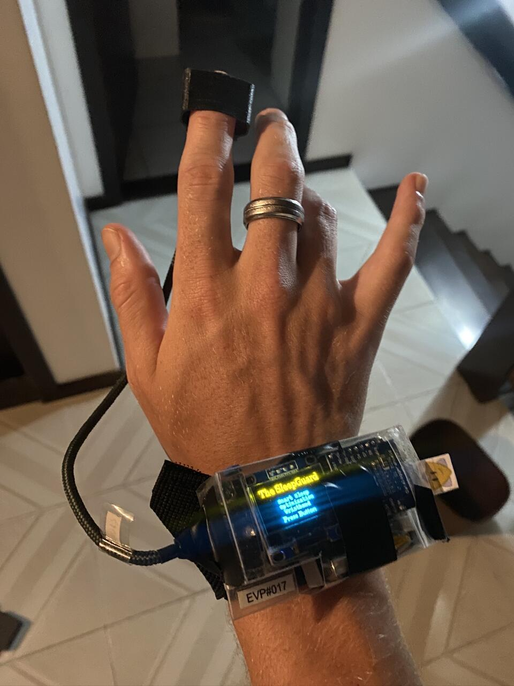

# TheSleepGuard 💤

**Smart Sleep Optimization Wristband**

A wearable device designed to monitor and improve sleep quality through real-time heart rate analysis and sleep phase detection.



## 🎓 Project Context

- **Period**: August 2023 - December 2023
- **Institution**: ESME SUDRIA (France) in partnership with UDESC (Universidade do Estado de Santa Catarina, Brazil)
- **Location**: Joinville, Brazil - International academic exchange (6 months)
- **Course**: Digital Signal Processing / Embedded Systems
- **Team**: Tom Huyghe, Adèle Faillé
- **Supervisor**: Prof. Alexander Paterno

## 🎯 Objective

Develop a wristband using Digital Signal Processing (DSP) techniques to monitor and improve sleep quality by providing real-time feedback and personalized recommendations based on heart rate variability (HRV) analysis.

## 🔧 Hardware Components

- **Microcontroller**: Arduino-compatible board
- **Heart Rate Sensor**: MAX30105 (PPG - Photoplethysmography)
- **Accelerometer**: Motion detection for sleep analysis
- **Display**: OLED screen (128x64) for user interface
- **Storage**: SD card module for data logging
- **Interface**: Physical button for menu navigation
- **Power**: USB connection

## ⚙️ Key Features

### 1. Real-Time Monitoring
- Continuous heart rate measurement during sleep
- Data recording to SD card in CSV format (timestamp, BPM)
- Infrared threshold detection (>50,000) for finger presence

### 2. Sleep Phase Detection
Based on Heart Rate Variability (HRV) analysis:

| Sleep Phase | BPM Range | Description |
|-------------|-----------|-------------|
| **WAKE** | > 73 BPM | Fully awake and alert |
| **REM Sleep** | 58-73 BPM | Rapid eye movement, vivid dreaming |
| **Light Sleep** | 45-58 BPM | Transitional stage, easy to wake |
| **Deep Sleep** | < 45 BPM | Restorative sleep (SWS) |

### 3. Interactive User Interface
- **Main Menu**: 
  - "Starting Sleep" → Begin recording session
  - "Starting Analysis" → Analyze recorded data
- Real-time display of sleep phase durations
- OLED screen with intuitive navigation

### 4. Signal Processing Pipeline

```
Data Collection → Preprocessing → Segmentation → Analysis → Visualization
       ↓              ↓              ↓            ↓            ↓
   Record AVG     FIR Filter    Sleep Phase   Button/App   MATLAB/Python
   Heart Rate     (0.1 Hz)      Classification  Display      Graphics
```

#### Data Preprocessing
- **FFT Analysis**: Fourier Transform to identify signal frequencies
- **FIR Low-Pass Filter**: 
  - Order: 30
  - Cutoff frequency: 0.1 Hz
  - Designed in MATLAB, implemented in Arduino
  - Smooths heart rate variations
- **Convolution**: BeatAVG signal convolved with FIR filter

## 📊 Results

- **Functional prototype** with wristband form factor
- **Accurate sleep cycle detection** over 7-hour night sessions
- **Sleep cycle visualization** showing 3-5 cycles per night (90-minute cycles)
- **Real-time analysis** displayed on OLED screen
- **Data export** for advanced visualization in MATLAB/Python

### Example Output
```
WAKE:  0:26:00
REM:   1:23:00
LIGHT: 3:45:00
DEEP:  1:52:00
```

## 💻 Tech Stack

### Embedded Software
- **Language**: C++ for Arduino
- **Libraries**: 
  - `MAX30105.h` - Heart rate sensor
  - `U8g2lib.h` - OLED display
  - `SD.h` - SD card storage
  - `heartRate.h` - Beat detection algorithm

### Data Analysis
- **MATLAB**: Signal processing, filter design, visualization
- **Python**: Data analysis, FFT, convolution plots
- **Libraries**: NumPy, Pandas, Matplotlib, SciPy

### Hardware
- Arduino IDE
- Breadboard prototyping
- Sensor integration (I2C, SPI protocols)

## 🧠 Skills Developed

- Embedded C++ programming for real-time systems
- Digital Signal Processing (FFT, FIR filters, convolution)
- Physiological signal analysis (HRV, PPG)
- Sensor integration and calibration
- User interface design for embedded systems
- Scientific data visualization
- International academic collaboration

## 📈 Methodology

1. **Data Collection**: Record average heart rate using MAX30105 sensor
2. **Preprocessing**: Apply FFT and FIR low-pass filter to smooth signal
3. **Segmentation**: Classify heart rate into sleep phases using threshold-based algorithm
4. **Display & Reporting**: Show results on OLED screen and export data
5. **Modeling & Interpretation**: Visualize sleep cycles in MATLAB with proper graphics

## 🚀 Future Improvements

- Integration of oximeter for SpO2 measurement
- Smart alarm feature based on real-time sleep phase analysis
- Personalized sleep recommendations based on historical data
- Wireless data transmission (Bluetooth/WiFi)
- Mobile app for enhanced data visualization

## 📁 Repository Structure

```
TheSleepGuard/
├── main.ino                    # Main Arduino sketch
├── MesureSleep.cpp/.h          # Heart rate measurement module
├── Analysing.cpp/.h            # Sleep phase analysis module
├── Python/
│   ├── FFT.py                  # Frequency analysis
│   ├── CONVO.py                # Convolution visualization
│   └── untitled0.py            # Data plotting
├── MATLAB/
│   ├── FFTMAT.m                # FFT and filter design
│   └── codeProf24oct.m         # Sleep cycle analysis
└── docs/
    └── presentation.pdf        # Project presentation
```

## 📝 References

- ELVEE Pulse sensor documentation
- Heart Rate Variability (HRV) research papers
- Sleep cycle studies (90-minute cycles)
- MAX30105 sensor datasheet

## 🤝 Acknowledgments

Special thanks to Prof. Alexander Paterno (UDESC) for supervision and guidance, and to ESME SUDRIA and UDESC for facilitating this international academic partnership.

---

**Project Status**: ✅ Completed (December 2023)  
**Academic Grade**: Validated - M1 Embedded Systems Course

---

*Developed during international academic exchange at UDESC, Joinville, Brazil*
